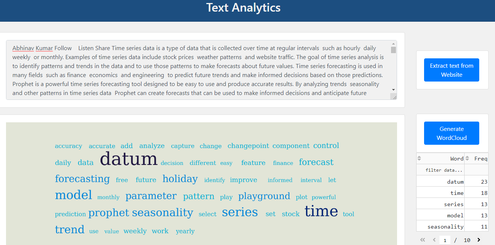
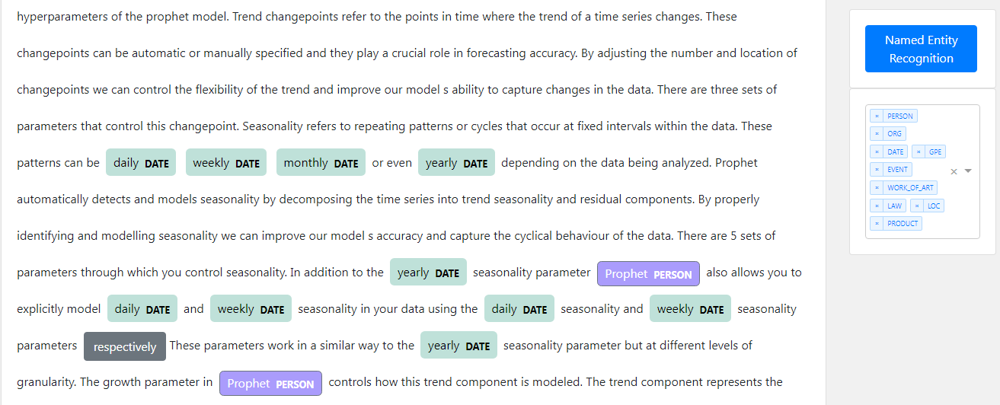

# NLP Application

## [Application 1 - Text Analytics](https://nlp-app-production.up.railway.app/app/text_analysis)

"Text Analysis Toolkit." This repository houses an advanced suite of tools for text analysis and understanding. Whether you have a link to an article, a blog post, or simply a block of text, this toolkit allows you to extract valuable insights and visualize key information.

With the ability to process both URLs and plain text, the toolkit offers a seamless experience for users. Upon inputting the text, it automatically generates a word cloud, providing a visual representation of the most prominent words and their frequencies. This aids in identifying the key themes and topics within the text.

Additionally, the toolkit incorporates Name Entity Recognition (NER) to identify and extract entities such as names, locations, organizations, and more. This helps in understanding the context and identifying significant entities within the text.

Furthermore, the toolkit offers a summarization feature, which condenses the text into a concise and informative summary. This allows users to quickly grasp the main points and extract essential information from lengthy texts.

